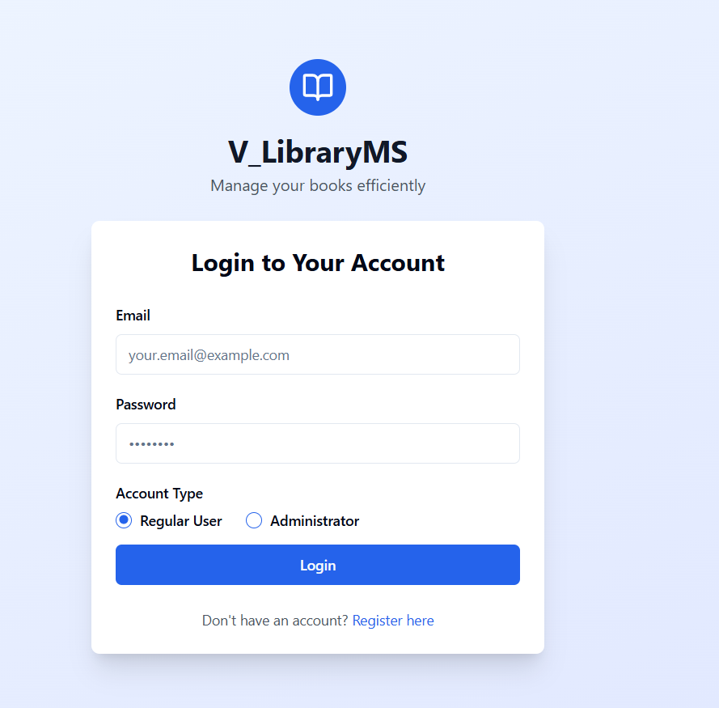
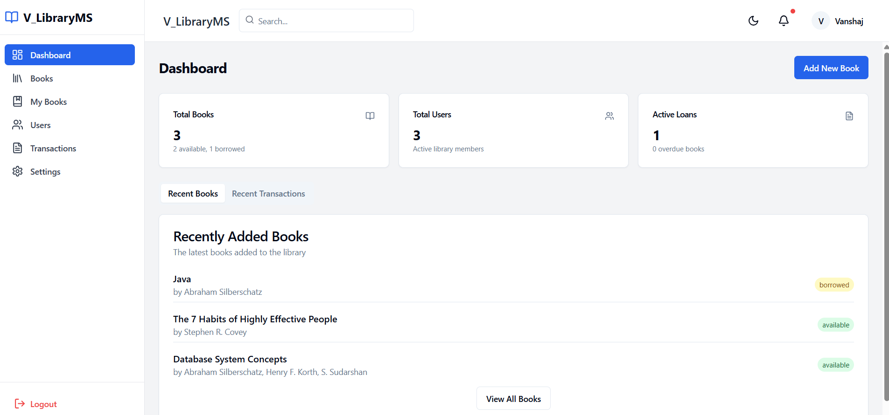
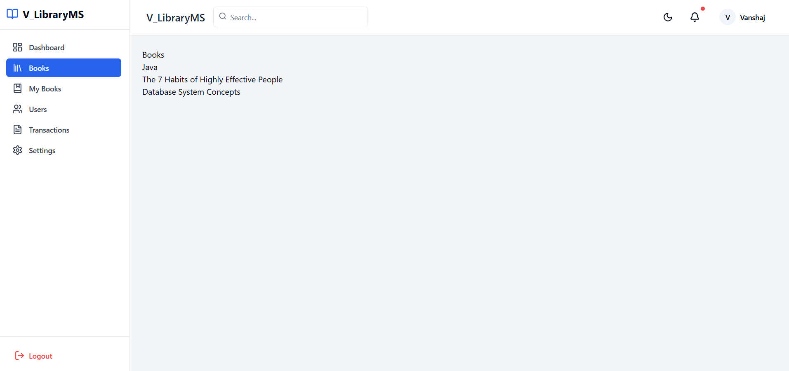
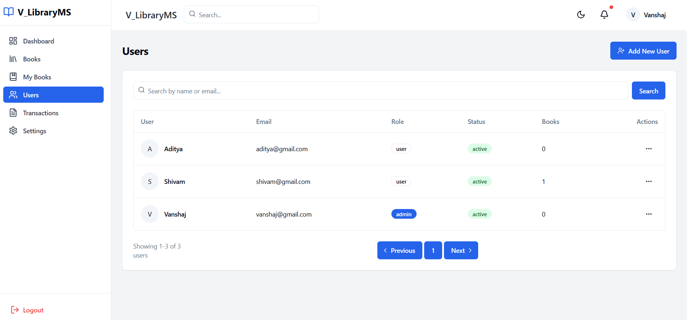
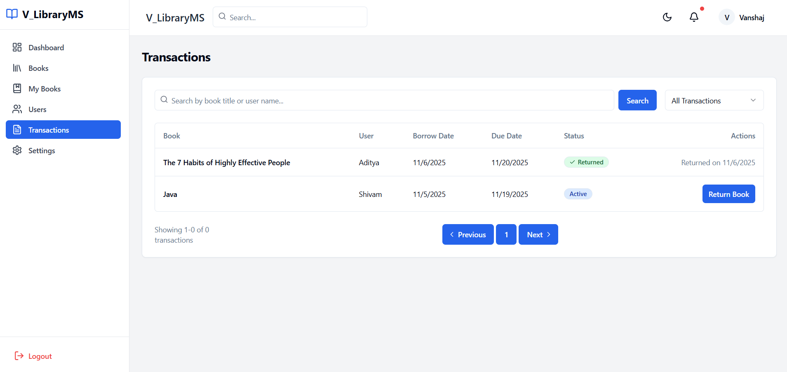
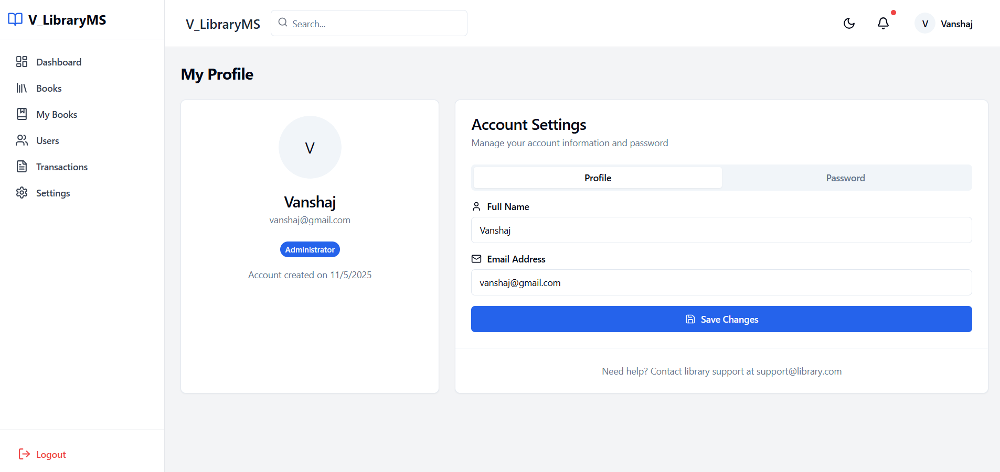

# Library Management System
## Project Overview
The Library Management System is a full-stack web application designed to simplify library operations such as managing books, members, and issuing or returning books.
The system allows administrators to maintain records of books and users efficiently, track book issues and returns, and monitor library activity through an intuitive interface.
The project is divided into two main parts: the backend and the frontend.
## Screenshots







## Features
1. User Authentication (Admin Login)
2. Manage Books (Add, Update, Delete, Search)
3. Manage Members (Add, Update, Delete, Search)
4. Issue and Return Books
5. Track Due Dates and Fines (if implemented)
6. Dashboard Overview (Issued Books, Total Members, Available Books)
7. Search and Filter Books by Title, Author, or ISBN
8. Responsive UI Design
## Technologies Used
1. Backend: Node.js, Express.js, MySQL, MySQL2 / Sequelize, JWT Authentication, bcrypt, dotenv.
2. Frontend: React.js Tailwind CSS / Bootstrap, React Router, Axios for API calls
## Prerequisites
1. Node.js (v14 or above)
2. npm or yarn
3. MySQL Server installed and running locally
4. MySQL Workbench (optional, for database management)
## Setup Instructions
### Clone the Repository
```
git clone https://github.com/Vanshaj16/Library-Management-System.git
cd Library-Management-System
```
### Set Up MySQL Database
1. Open MySQL Workbench or Command Line.
2. Create a new database:
```
CREATE DATABASE library_management;
```
3. (Optional) Create a new user with privileges:
```
CREATE USER 'library_admin'@'localhost' IDENTIFIED BY 'yourpassword';
GRANT ALL PRIVILEGES ON library_management.* TO 'library_admin'@'localhost';
FLUSH PRIVILEGES;
```
4. Note down your database name, username, and password for environment configuration.

### Configure Environment Variables
Create a .env file in the backend directories with the following content:
```
PORT=5000
DB_HOST=localhost
DB_USER=library_admin
DB_PASSWORD=yourpassword
DB_NAME=library_management
JWT_SECRET=your_jwt_secret
```
### Install Dependencies
Backend
```
cd backend
npm install
```

Frontend
```
cd ../frontend
npm install
```
### Run the Backend Server
```
cd backend
node server.js
```
### Run the Frontend Server
```
cd ../frontend
npm start
```
This will start the frontend development server. Open http://localhost:3000 to view it in your browser.

## Usage
###Login
1. Use your admin credentials to log in.
2. Once logged in, you can access all sections of the system.
###Manage Books
1. Navigate to Books section.
2. Add new books with title, author, ISBN, and quantity.
3. Edit or delete existing book entries.
###Manage Members
1. Navigate to Members section.
2. Add, update, or delete member details.
###Issue and Return Books
1. Select a member and choose a book to issue.
2. The system records issue date and due date.
3. When a book is returned, availability is updated automatically.
###Search and Filter
1. Search books by title, author, or ISBN.
2. Filter members or issued books easily.

### Contributing
Contributions are welcome! Please fork the repository and create a pull request with your changes.
## Author 
Name: Vanshaj

Email: vanshajsen16@gmail.com